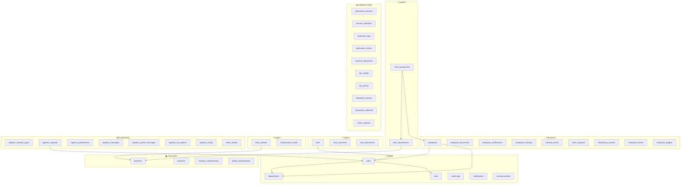
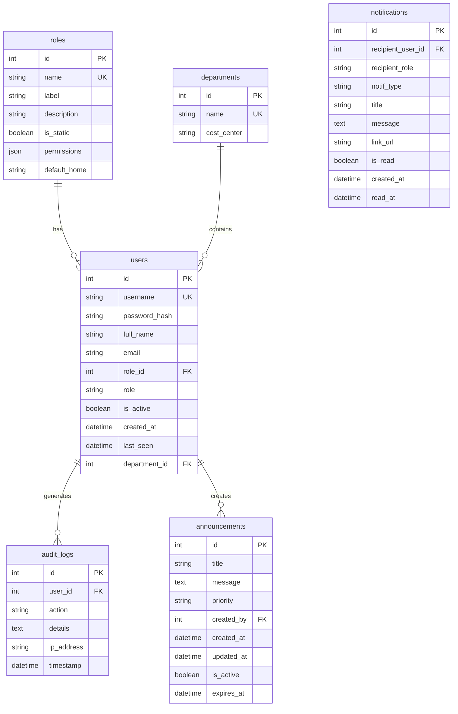
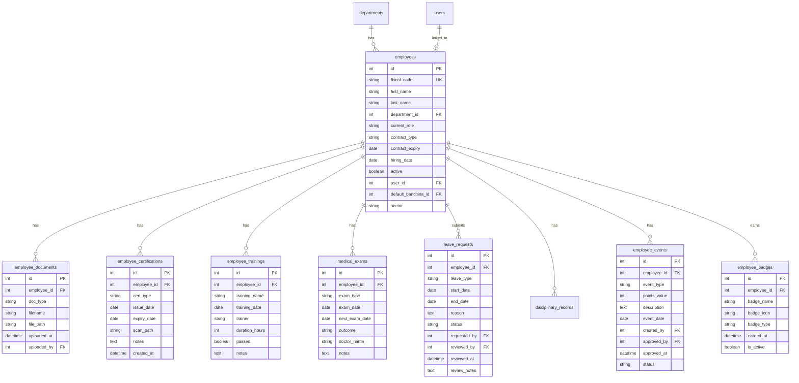
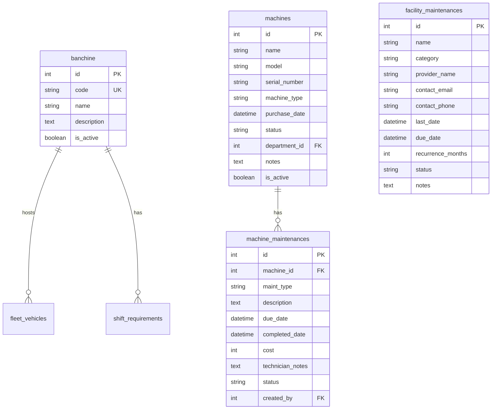
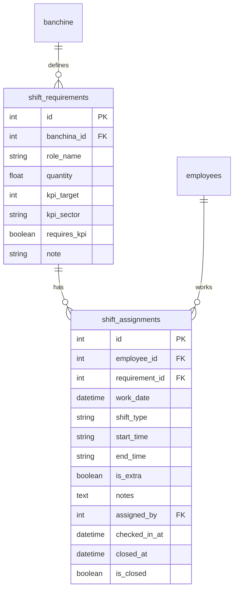
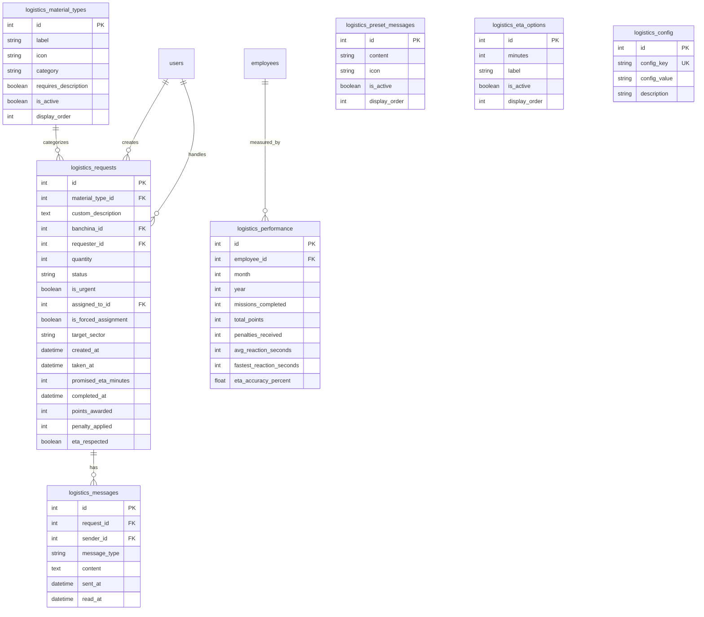
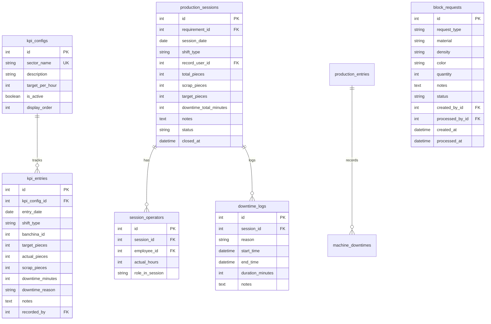
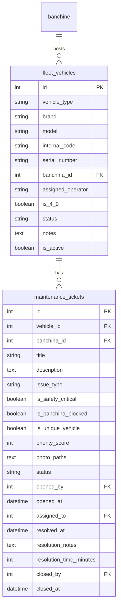
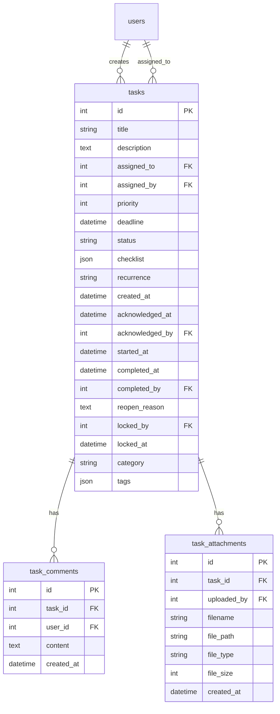

# 🗄️ Diagramma Entity-Relationship - SL Enterprise

**Versione:** 2.0  
**Ultimo Aggiornamento:** 1 Febbraio 2026  
**Tabelle Totali:** 40+  
**Moduli:** 8  

---

## Panoramica Architettura

Il database SL Enterprise è organizzato in **8 moduli funzionali** interconnessi:

---

## Dettaglio Moduli

### 1. 🔐 CORE - Autenticazione e Sistema

---

### 2. 👔 HR SUITE - Gestione Risorse Umane

---

### 3. 🏭 FACTORY - Stabilimento e Macchinari

---

### 4. 📅 SHIFTS - Pianificazione Turni

---

### 5. 📦 LOGISTICS - Sistema Richieste Materiale

---

### 6. 📊 PRODUCTION - KPI e Produzione

---

### 7. 🚛 FLEET - Parco Mezzi

---

### 8. ✅ TASKS - Gestione Attività

---

## Riepilogo Relazioni Principali

| Tabella Origine | Relazione | Tabella Destinazione |
|-----------------|-----------|---------------------|
| `users` | N:1 | `roles` |
| `users` | N:1 | `departments` |
| `employees` | 1:1 | `users` |
| `employees` | N:1 | `departments` |
| `shift_assignments` | N:1 | `employees` |
| `shift_assignments` | N:1 | `shift_requirements` |
| `shift_requirements` | N:1 | `banchine` |
| `fleet_vehicles` | N:1 | `banchine` |
| `logistics_requests` | N:1 | `users` (requester) |
| `logistics_requests` | N:1 | `users` (assigned_to) |
| `logistics_requests` | N:1 | `logistics_material_types` |
| `tasks` | N:1 | `users` (assigned_to) |
| `tasks` | N:1 | `users` (assigned_by) |
| `kpi_entries` | N:1 | `kpi_configs` |

---

*Diagramma generato automaticamente - SL Enterprise v2.0*
